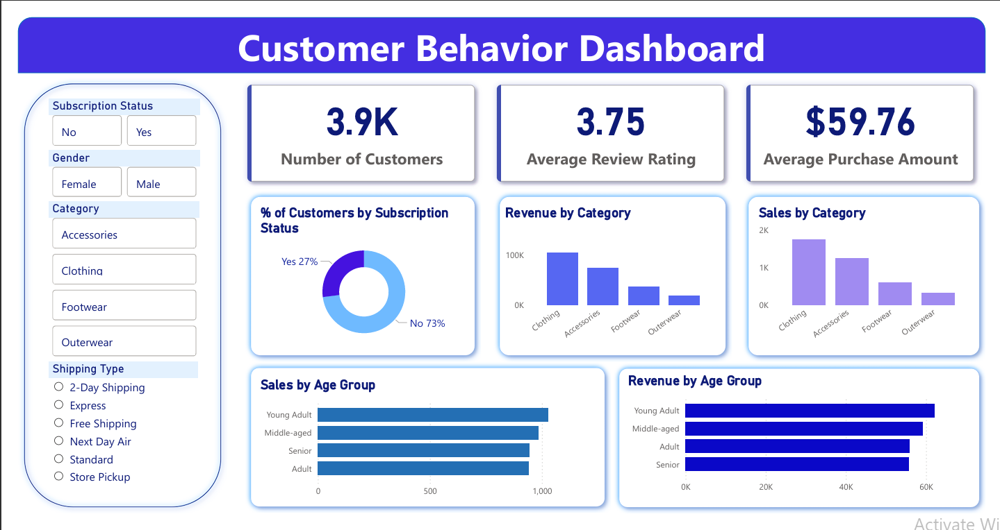

# 🛍️ Customer Shopping Behavior Analysis

## 📊 Project Overview

This project analyzes **customer shopping behavior** using transactional data from **3,900 purchases** across multiple product categories.

The objective is to identify **spending patterns, customer segments, product preferences, and subscription behavior** to support better business decision-making.

---

## 📁 Dataset Summary

* **Rows:** 3,900
* **Columns:** 18

### Key Features

* **Customer Demographics:** Age, Gender, Location, Subscription Status
* **Purchase Details:** Item Purchased, Category, Purchase Amount, Season, Size, Color
* **Shopping Behavior:** Discount Applied, Promo Code Used, Previous Purchases, Frequency of Purchases, Review Rating, Shipping Type

### Data Quality

* **Missing Values:** 37 values in the *Review Rating* column
* Missing ratings were handled using the **median rating per product category**.

---

## 🛠️ Technologies Used

* **Python** – Data cleaning and preprocessing
* **Pandas & NumPy** – Data manipulation
* **PostgreSQL** – Business query analysis
* **Power BI** – Data visualization and dashboard creation

---

## 🧹 Data Preparation (Python)

Steps performed during preprocessing:

* Loaded dataset using **Pandas**
* Inspected dataset using `df.info()` and `df.describe()`
* Handled missing values in **Review Rating**
* Renamed columns using **snake_case**
* Created new features:

  * `age_group`
  * `purchase_frequency_days`
* Removed redundant column `promo_code_used`
* Loaded cleaned data into **PostgreSQL** for SQL analysis

---

## 🗄️ Data Analysis (SQL)

Key business questions analyzed:

1. Revenue comparison by **Gender**
2. High-spending customers who **used discounts**
3. **Top 5 products** by average rating
4. Purchase comparison between **Standard vs Express shipping**
5. Spending patterns of **Subscribers vs Non-Subscribers**
6. Products most dependent on **discounts**
7. **Customer segmentation** (New, Returning, Loyal)
8. **Top 3 products per category**
9. Relationship between **repeat purchases and subscriptions**
10. **Revenue contribution by age group**

---

## 📈 Power BI Dashboard

An interactive **Power BI dashboard** was created to visualize:

* Revenue distribution
* Customer segmentation
* Top product categories
* Shipping type comparisons
* Age group purchasing trends

The dashboard allows quick understanding of **customer purchasing behavior and trends**.

---

## 💡 Business Recommendations

* Promote **subscription benefits** to increase retention
* Introduce **customer loyalty programs**
* Optimize **discount strategies** to balance profit margins
* Highlight **top-rated and best-selling products** in marketing campaigns
* Focus marketing on **high-revenue customer segments**

---

## 📂 Project Structure

```
customer-shopping-behavior-analysis
│
├── data
│   └── customer_shopping_behavior.csv
│
├── notebooks
│   └── Customer_Shopping_Behavior_Analysis.ipynb
│
├── sql
│   └── customer shopping behavior.sql
│
├── dashboard
│   ├── customer_behavior_dashboard.pbix
│   └── dashboard.png
│
├── docs
│   ├── Business Problem Document.pdf
│   ├── Customer Shopping Behavior Analysis.pdf
│   └── Customer-Shopping-Behavior-Analysis.pptx
│
├── README.md
├── LICENSE
└── .gitignore
```

---


## 👩‍💻 Author

**Sithumi Samadhi**

Undergraduate – Computer Science

Data Science Pathway


## 📊 Dashboard Preview

